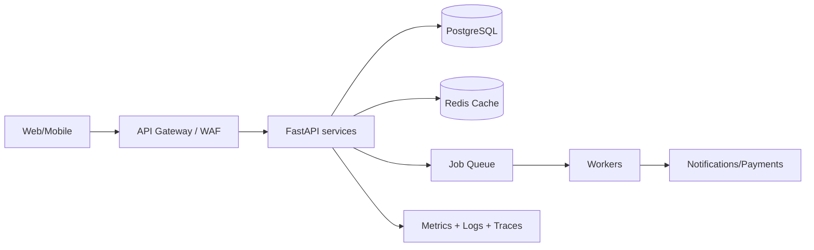
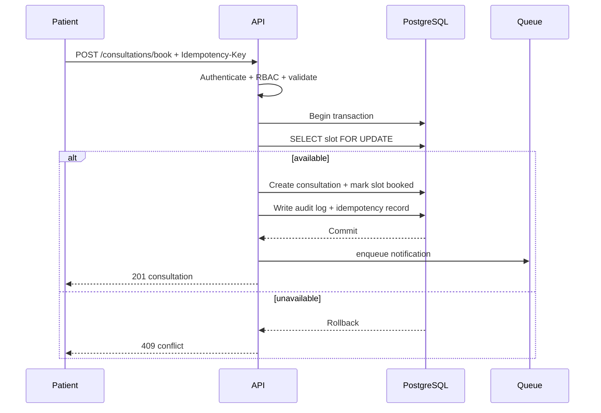
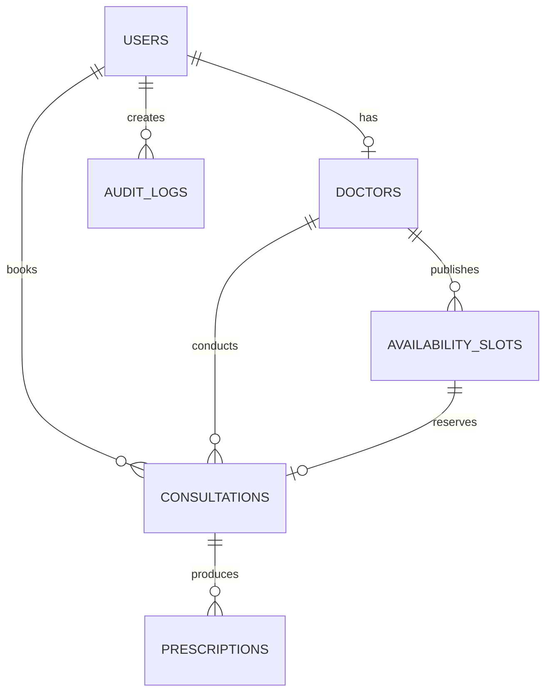

# Amrutam Telemedicine Architecture

## 1. High-level architecture and data flow

At 100k consultations/day the average rate is only ~1.2 consultations/sec, but traffic is bursty. Stateless API replicas scale horizontally. PostgreSQL is the source of truth; Redis is a cache, never the authoritative booking state. Heavy notification, reporting and payment reconciliation tasks are asynchronous.

## 2. Booking sequence

## 3. Data model

Core tables: users, profiles/doctors, availability_slots, consultations, prescriptions, payments, audit_logs. Production should add profiles and payments with encrypted/tokenized sensitive fields.

## 4. API contract

REST is used because booking, lifecycle transitions and operational integrations map cleanly to resources. OpenAPI is exposed automatically at `/openapi.json` and Swagger UI at `/docs`.

Important response semantics:
- `401` invalid/missing authentication
- `403` insufficient role
- `409` booking conflict or idempotency conflict
- `422` validation failure
- `429` rate limit
- `503` dependency unavailable

## 5. Reliability and concurrency

Booking uses a database transaction and row-level lock (`FOR UPDATE`). A unique constraint on `slot_id` prevents double booking at the database level. `Idempotency-Key` makes client retries safe.

Transient external failures use exponential backoff with jitter, e.g. 250ms, 500ms, 1s, 2s, max 5 attempts. Non-idempotent external calls use an outbox/saga pattern. Dead-letter queues capture exhausted jobs.

## 6. Partitioning and caching

Audit logs and consultations can be range-partitioned by month as volume grows. Indexes should cover `(doctor_id, starts_at, status)`, `(patient_id, created_at)`, and searchable doctor specialty/name. Cache doctor search and availability reads with short TTLs; invalidate availability cache after booking.

## 7. Transactions and sagas

The booking transaction owns only local database state. Notification/payment operations occur after commit through an outbox. A saga coordinates payment authorization, consultation confirmation and compensation (refund/release slot) if a downstream step fails.

## 8. Backup and disaster recovery

Managed PostgreSQL: continuous WAL/PITR, daily snapshots, encrypted cross-region backup copy. Target RPO <= 5 minutes and RTO <= 30 minutes. Restore tests should run at least quarterly. Redis is disposable and rebuilt from PostgreSQL.

## 9. Scaling and SLOs

- p95 reads <200ms: indexed queries + Redis + connection pooling
- p95 writes <500ms: short DB transactions and async side effects
- 99.95% monthly availability target
- Horizontal API scaling behind load balancer
- DB read replicas for analytics/search-heavy reads
- Separate analytics workload from transactional primary
